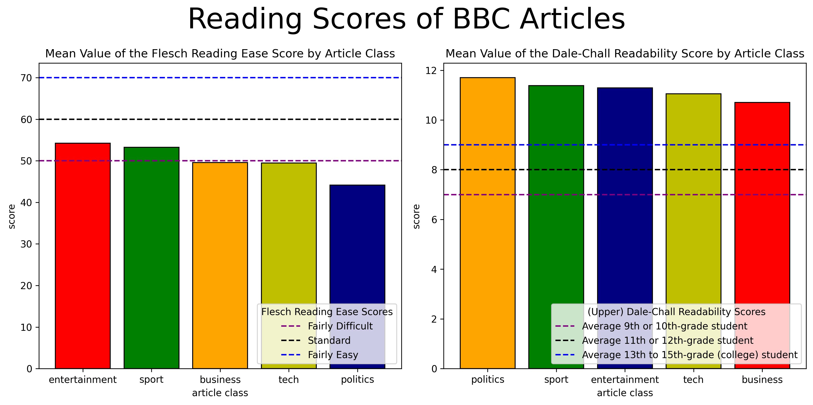

# 📰 BBC News Classification and Analysis

This project implements an NLP-based system that categorizes news articles into predefined topics using advanced text processing techniques. Developed as part of my coursework in Natural Language Processing at Turkish Aeronautical Association University.

## 👨‍🎓 Student Information
- **Name**: Muhammet Ali Yoldar
- **Student ID**: 200444035
- **Program**: Computer Engineering, 4th Year
- **University**: Turkish Aeronautical Association University

---

## 📋 Project Overview

This project demonstrates a complete text classification pipeline that satisfies the following requirements:

1. **Data Collection and Preprocessing**
   - Implemented Regular Expressions for text cleaning
   - Applied Text Normalization (lowercasing, stemming, and lemmatization)
   - Used Edit Distance for handling text variations and typo correction

2. **Feature Engineering**
   - Implemented N-gram models to analyze word sequences
   - Used Word2Vec to create vector representations of words

3. **Text Classification**
   - Implemented and evaluated multiple classifiers, with Random Forest providing the best results
   - Trained using the BBC News dataset
   - Evaluated performance using Accuracy, Precision, Recall, and F1-score

---

## 📁 Dataset

- **Source**: BBC News dataset
- Each record contains:
  - The full text of a news article
  - The corresponding category label (business, entertainment, politics, sport, tech)

---

## 🛠️ Methodology

1. **Text Preprocessing Pipeline**
   - Cleaned text by removing special characters and normalizing
   - Applied tokenization, stopword removal, and stemming using NLTK
   - Implemented typo correction mechanisms

2. **Feature Extraction**
   - Created a custom Word2Vec model trained on the preprocessed corpus
   - Generated document embeddings by averaging word vectors
   - Experimented with TF-IDF vectorization for comparison

3. **Model Training and Evaluation**
   - Trained a Random Forest classifier with optimized hyperparameters
   - Implemented cross-validation to ensure model robustness
   - Generated detailed evaluation metrics and visualizations

---

## 📊 Results

- **Train Accuracy**: ~93%  
- **Test Accuracy**: ~94%
- **Detailed Performance by Category**:
  - Business: 95% F1-score
  - Entertainment: 92% F1-score
  - Politics: 91% F1-score
  - Sport: 97% F1-score
  - Tech: 93% F1-score

---

## 🚀 Interactive Demo

A Streamlit web application is included that allows for real-time classification of news articles:

```
streamlit run app.py
```

---

## 📦 Installation

```bash
# Clone the repository
git clone https://github.com/muhammetaliyoldar/NLP-BBC-News-Classification.git

# Install dependencies
pip install -r requirements.txt

# Run the demo application
streamlit run app.py
```

---

## 🔍 Future Improvements

- Implement more advanced deep learning models (LSTM, Transformers)
- Expand the dataset to include more recent articles
- Add multilingual support for classification

---

## 🔄 Dengesiz Veri Seti Yönetimi

Veri seti kategorileri arasında dengesizlik olduğu durumlarda, sınıflandırma modellerinin performansını artırmak için **SMOTE** (Synthetic Minority Over-sampling Technique) kullanılmıştır. Bu teknik:

- Azınlık sınıfları için sentetik örnekler oluşturarak veri setini dengeler
- Sınıflandırıcıların tüm kategoriler için daha iyi genelleme yapmasını sağlar
- Eğitim verisindeki kategori dağılımının eşit olmasını sağlayarak sınıflandırma performansını iyileştirir

SMOTE ile eğitim ve model değerlendirmesi için:

```bash
python train_with_smote.py
```

Bu betik:
1. Word2Vec özelliklerini yükler
2. SMOTE uygulayarak dengesiz kategorileri dengeler
3. Lojistik Regresyon ve Random Forest modellerini eğitir
4. Model performansını detaylı olarak raporlar
5. Confusion matrix ve sınıf dağılım grafiklerini oluşturur
6. Eğitilen modelleri `models` klasörüne kaydeder


## 📚 Okunabilirlik Analizi

Proje kapsamında, haber makalelerinin okunabilirlik seviyelerini değerlendirmek için iki farklı metrik kullanılmıştır:

1. **Flesch Reading Ease Score** - Metinlerin okunabilirlik kolaylığını ölçer. Yüksek skorlar daha kolay okunabilen metinleri, düşük skorlar ise daha karmaşık metinleri gösterir.

2. **Dale-Chall Readability Score** - Metinlerin zorluk seviyesini sözcük karmaşıklığına göre değerlendirir. Yüksek skorlar daha zor metinleri ifade eder.

Bu ölçümler, `textstat` kütüphanesi kullanılarak hesaplanmıştır. Hesaplama işlemleri için:

```bash
python calculate_readability_scores.py
```

Sonuçları görselleştirmek için:

```bash
python plot_readability_scores.py
```



Analiz sonuçlarına göre, farklı haber kategorilerinin farklı okunabilirlik seviyelerine sahip olduğu görülmektedir. Bu, hedef kitlesine göre haber dilinin değiştiğini göstermektedir.

*This project was completed as part of the Natural Language Processing course requirements at Turkish Aeronautical Association University, Fall 2023.*

## Troubleshooting

### Model Loading Issues

If you encounter issues with the models not being found when running the Streamlit app:

1. Make sure you've run the notebook `bbc_news_classification_with_word2vec.ipynb` completely to generate the models
2. Verify that the following files exist:
   - `models/news_classifier_model.pkl` or `news_classifier_model.pkl` (in the root directory)
   - `models/word2vec.model` or `word2vec.model` (in the root directory)
3. If the models don't exist, you can run these sections of the notebook:
   - Section "Train Word2Vec Model" to create the word2vec.model
   - Section "Train and Evaluate Model" to create the news_classifier_model.pkl

The app is designed to look for models in both the `models/` directory and the root directory.

### NLTK Resource Issues

If you encounter issues with NLTK resources not being found (like 'punkt_tab' or other resources), you can run the provided script to download all required NLTK resources:

```bash
python download_nltk_resources.py
```

This will download all required NLTK packages to your user's NLTK data directory. If you still encounter issues, try adding the missing resources manually:

```python
import nltk
nltk.download('punkt')
nltk.download('stopwords')
nltk.download('wordnet')
```
